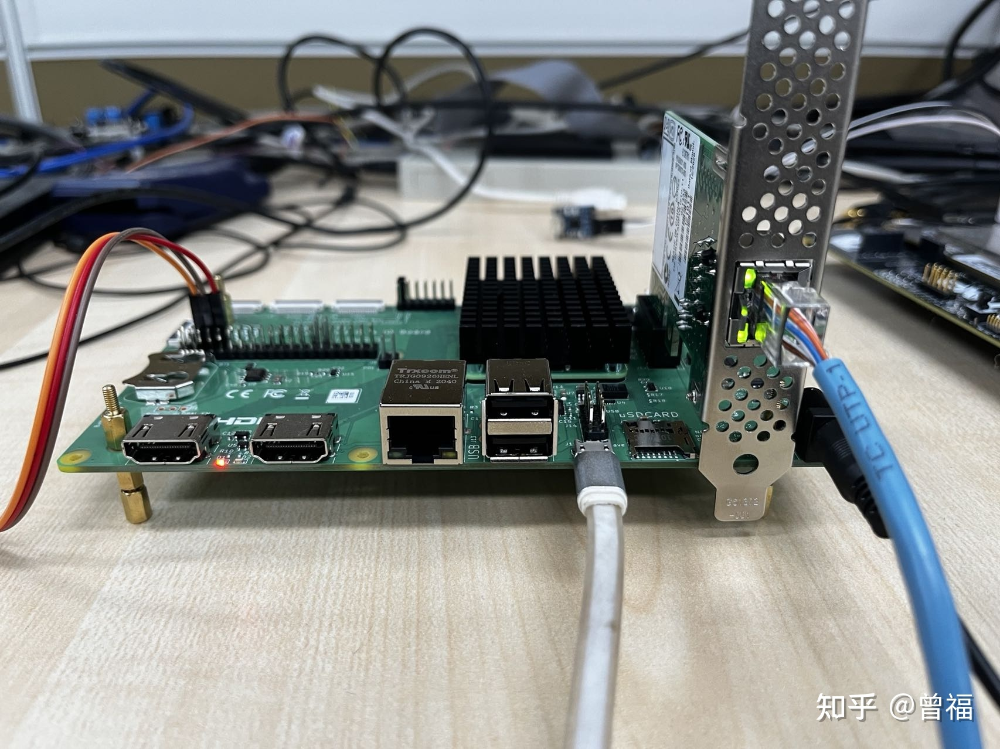
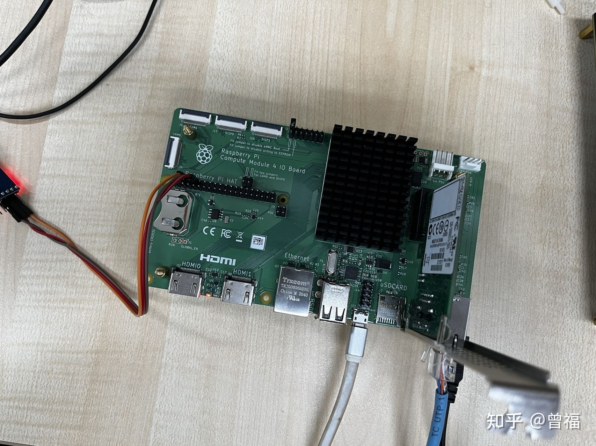

# Automotvie Ethernet Platform

This README file contains information on the contents of the meta-autoeth layer.

Please see the corresponding sections below for details.

## Dependencies

  * URI: git://git.yoctoproject.org/poky
    * branch: honister
    * revision: HEAD

  * URI: https://github.com/openembedded/meta-openembedded
    * branch: honister
    * revision: HEAD

  * URI: https://github.com/agherzan/meta-raspberrypi
    * branch: honister
    * revision: HEAD


## Quick Start

1. source poky/oe-init-build-env build
2. Run 'bitbake-layers add-layer meta-autoeth'
3. Run 'bitbake-layers add-layer meta-raspberrypi'
4. Run 'bitbake-layers add-layer meta-openembedded/meta-oe'
5. Run 'bitbake-layers add-layer meta-openembedded/meta-python'
6. Run 'bitbake-layers add-layer meta-openembedded/meta-networking'
7. Append these into local.conf
```
MACHINE = "raspberrypi4-64"
# PI config 
IMAGE_FSTYPES = "tar.bz2 ext4.xz ext4 wic wic.bmap wic.bz2"
SDIMG_ROOTFS_TYPE = "ext4"
ENABLE_UART = "1"
ENABLE_DWC2_HOST = "1"

# IMAGE_INSTALL_append = " kernel-modules linuxptp pps-tools openssh openssl"
DISTRO_FEATURES:append = " systemd"
VIRTUAL-RUNTIME_init_manager = "systemd"

```
8. bitbake autoeth

## Flash Image


## Maintainers

* Frankie Zeng `<frankie.zengfu@gmail.com>`

## Board Picture



